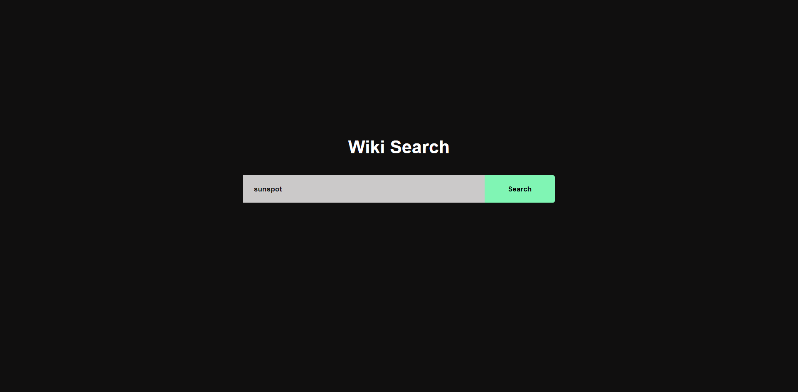
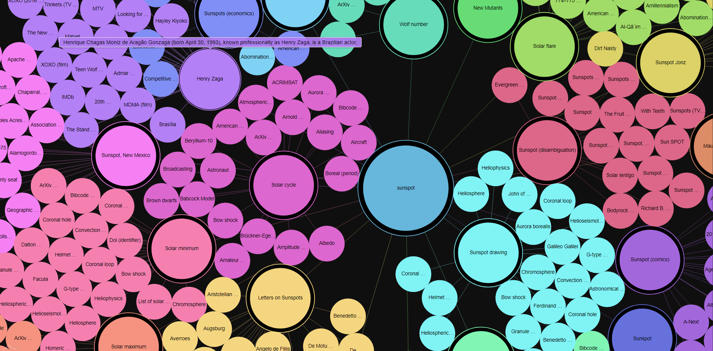

<div align="center">


<h1>Wiki Graph</h1>
<h3>A Wikipedia search visualization toolkit</h3>


[](https://wiki-graph.francis.run)
[](https://github.com/francis-du/wiki-graph/actions?query=workflow:cargo-test)
[](https://github.com/francis-du/wiki-graph/actions?query=workflow:mdbook-deploy)
</div>

-----------------------------------------------------------------------------------------------

## How to use

Enter keywords and click search, it will generate a network graph.

[](https://wiki-graphs.herokuapp.com)

## Search result

[](https://wiki-graphs.herokuapp.com)

## [Live demo](https://wiki-graphs.herokuapp.com/)

## How to deploy

### CLI Command

```shell
░██╗░░░░░░░██╗██╗██╗░░██╗██╗  ░██████╗░██████╗░░█████╗░██████╗░██╗░░██╗
░██║░░██╗░░██║██║██║░██╔╝██║  ██╔════╝░██╔══██╗██╔══██╗██╔══██╗██║░░██║
░╚██╗████╗██╔╝██║█████═╝░██║  ██║░░██╗░██████╔╝███████║██████╔╝███████║
░░████╔═████║░██║██╔═██╗░██║  ██║░░╚██╗██╔══██╗██╔══██║██╔═══╝░██╔══██║
░░╚██╔╝░╚██╔╝░██║██║░╚██╗██║  ╚██████╔╝██║░░██║██║░░██║██║░░░░░██║░░██║
░░░╚═╝░░░╚═╝░░╚═╝╚═╝░░╚═╝╚═╝  ░╚═════╝░╚═╝░░╚═╝╚═╝░░╚═╝╚═╝░░░░░╚═╝░░╚═╝

Version: 0.1.0
A wiki graph app for Logseq Remote Interview.

USAGE:
    wiki-graph [FLAGS] [OPTIONS] <SUBCOMMAND>

FLAGS:
    -d, --debug      Activate debug mode
        --help       Prints help information
        --proxy      Using proxy network
    -V, --version    Prints version information

OPTIONS:
    -h, --host <host>    Set host [default: 0.0.0.0]
    -p, --port <port>    Set port [default: 3690]

SUBCOMMANDS:
    api     start a api service
    app     start a app service
    help    Prints this message or the help of the given subcommand(s)

```

### Local

- installation rust

- run `cargo run app` to start a service in ` http://0.0.0.0:3690`

- or use binary in `target/debug/` or `target/build/` to run `wiki-graph app` to start a service

### Heroku

[](https://heroku.com/deploy)

- installation hero CLI

- run commands

```shell
heroku login

heroku git:clone -a wiki-graphs 

cd wiki-graphs

git add .
git commit -am "hello heroku"
git push heroku master
```

## Docker

## License

[MIT LICENSE](LICENSE)